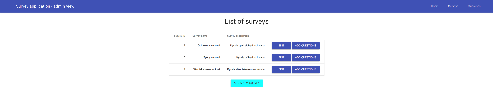

# Software project 1 course project - survey application
## Surveyapplication - backend

This is a survey application written in Java with Spring Boot. With this back-end the user is able to create new surveys with text and multiplechoice questions. This back-end web service has a REST API to interface with a separate front-end written in React where one can answer the surveys created through this back-end.

Used technologies:

- Java
- Spring Boot
- H2 database

[Open the backend UI](https://surveyapp-backend.herokuapp.com/).

## Screenshots

